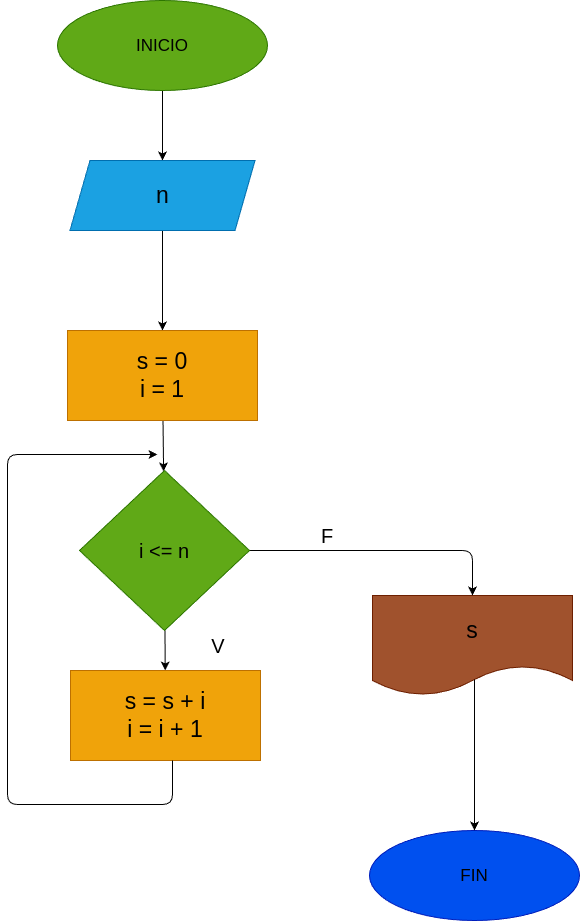

# While_1
Suma de los n primeros números náturales pero implementando un bucle.

# Analisis

## Input

### Variables de entrada
n: número al que se desea aplicar la formula.
### prosesisng
s: valor inicial de la suma.

i: siguiente dijito a sumar.

mientras i <= n:

s = s + i

i = i + 1

### output
s
# Diseño

 
# Construcción